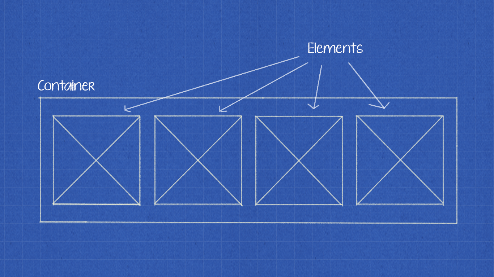
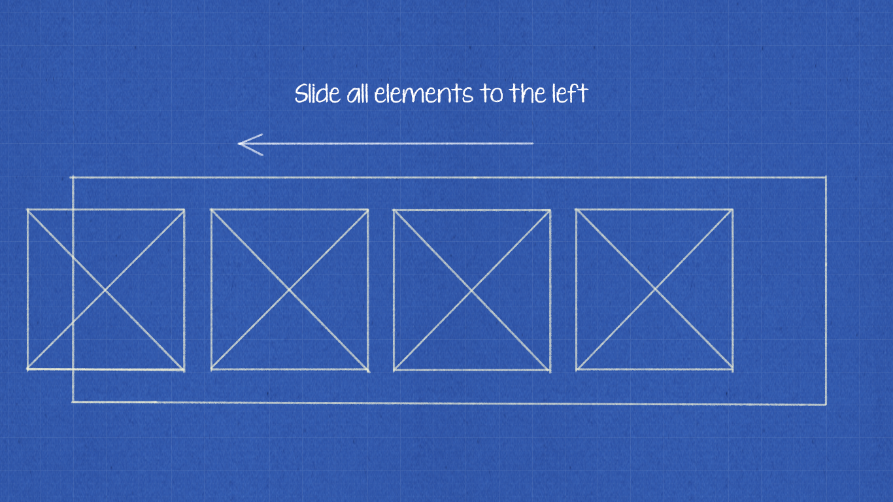
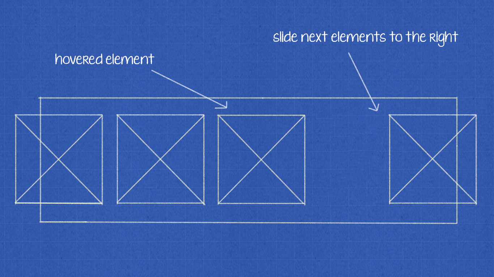
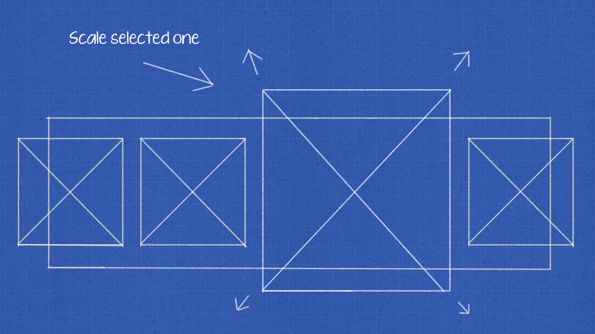
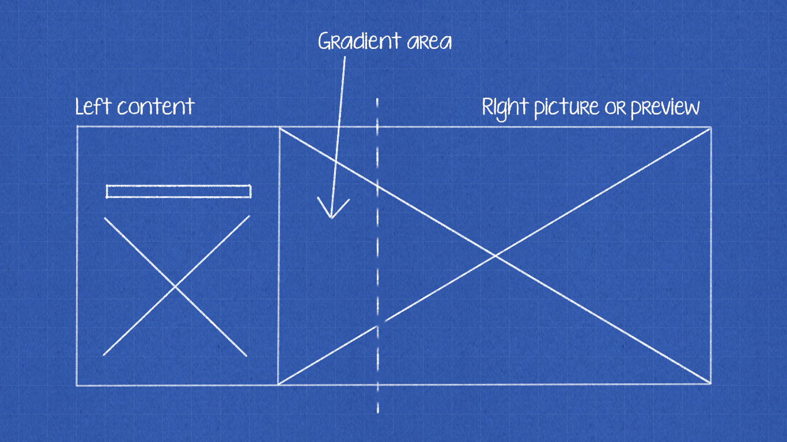

You probably have seen the Netflix user interface. Most of this interface consists of big sliders with expressive hover effect which is used for displaying movies and related information. Every single element contains a thumbnail of the movie, but when you hover, it will be zoomed and the rest of the elements will translate sideways — that’s how it basically works.

Today I want to show you that there is no magic, and it’s possible to do this in just a few steps.

## 💡Starting with container

At the beginning, let’s try to write that slider but without any hover or sliding effects. This will be a base for the next steps.



```html
  <div class="container">
    <div class="item">1</div>
    <div class="item">2</div>
    <div class="item">3</div>
    <div class="item">4</div>
    <div class="item">5</div>
  </div>
```

There is nothing complex - it’s just one container with the elements inside.

```css
.container {
  display: flex;
  padding: 0 55px;
}

.item {
  background: green;
  flex: 0 0 19.7%;
  text-align: center;
  margin: 0 2px;
  transition: transform 300ms ease 100ms;
}
```

The CSS is also quite short - container has flex display and all of the items belong to him with constant sizing.

## 💡Push them to the left side!

The algorithm starts with a simple translation. We have to move all of the elements to the left side of the container. So when we hover the container, all of the elements should move to the left.



There is a piece of code which will do this:

```css
.container:hover .item {
  transform: translateX(-25%);
}
```

We used here translation value of 25%, I’ll explain this reasoning later in the article.

## 💡Hmmm, now to the right!

The next step is very similar to the previous one. Basically, we have to do the same translation but on the other side and… without moving previous elements. It means we have to slide only elements that are after the hovered one.



Below code represents it:

```css
.item:hover ~ .item {
  transform: translateX(25%);
}
```

Again, you can see 25%, be patient!

## 💡 Apply hover effect

Now, we can spread up! The last thing what we need to do is scaling. We have to use another `transform` which is `scale`. The value of scaling is 1.5 — this is the reason we used translations with 25%. By using the 1.5 value to scale that element, it will increase the size by 150%, and this 50% is split into the 25% translation on each side. You can change these values of course, just make sure the math works out.



Scaling code:

```css
.item:hover {
  transform: scale(1.5) !important;
}
```

## 💡 Show me what you have!

We have the hovering effect, but this slider also shows the content when you click on the bottom arrow. There is nothing special besides the background behind, it has 30% of the left (dark) side and 70% of preview/picture. Furthermore, between these two elements is the gradient to make the left side edge smoother.




How to implement that background? Simply, `:before`, `:before`…

```html
  <div class="content">
    <div class="background">
      <div class="left">left</div>
      <div class="right">right</div>
    </div>
    <div class="content-container">content here...</div>
  </div>
```

```css
.content {
  margin-top: 40px;
  height: 300px;
  position: relative;
}

.background {
  display: flex;
  height: 100%;
}

.left {
  background: black;
  width: 30%;
  position: relative;
}

.left:before {
  content: '';
  position: absolute;
  background-image: linear-gradient(to right,#000,transparent);
  top: 0;
  bottom: 0;
  left: 100%;
  width: 275px;
}

.right {
  background: green;
  width: 70%;
}

.content-container {
  color: white;
  position: absolute;
  top: 0;
  left: 0;
  right: 0;
  bottom: 0;
  padding: 30px
}
```

## 💡 Where the React comes

Time to connect this with React. Let’s try also to extend this idea with sliding functionality and expanding as it is on the Netflix website. [There](https://github.com/andrzejewsky/netflix-slider) is available a full React code of this slider, but I want to explain the most important things to achieve final effect so let’s focus on these two files:

_Slider.js_
```js
import React, { useState } from 'react';
import cx from 'classnames';
import SliderContext from './context'
import Content from './Content'
import SlideButton from './SlideButton'
import SliderWrapper from './SliderWrapper'
import useSliding from './useSliding'
import useSizeElement from './useSizeElement'
import './Slider.scss'

const Slider = ({ children, activeSlide }) => {
  const [currentSlide, setCurrentSlide] = useState(activeSlide);
  const { width, elementRef } = useSizeElement();
  const {
    handlePrev,
    handleNext,
    slideProps,
    containerRef,
    hasNext,
    hasPrev
  } = useSliding(width, React.Children.count(children));

  const handleSelect = movie => {
    setCurrentSlide(movie);
  };

  const handleClose = () => {
    setCurrentSlide(null);
  };

  const contextValue = {
    onSelectSlide: handleSelect,
    onCloseSlide: handleClose,
    elementRef,
    currentSlide,
  };

  return (
    <SliderContext.Provider value={contextValue}>
      <SliderWrapper>
        <div
          className={cx('slider', { 'slider--open': currentSlide != null })}
        >
          <div ref={containerRef} className="slider__container" {...slideProps}>{children}</div>
        </div>
        {hasPrev && <SlideButton onClick={handlePrev} type="prev" />}
        {hasNext && <SlideButton onClick={handleNext} type="next" />}
      </SliderWrapper>
      {currentSlide && <Content movie={currentSlide} onClose={handleClose} />}
    </SliderContext.Provider>
  );
};

export default Slider;
```

_Item.js_
```js
import React from 'react';
import cx from 'classnames';
import SliderContext from './context'
import ShowDetailsButton from './ShowDetailsButton'
import Mark from './Mark'
import './Item.scss'

const Item = ({ movie }) => (
  <SliderContext.Consumer>
    {({ onSelectSlide, currentSlide, elementRef }) => {
      const isActive = currentSlide && currentSlide.id === movie.id;

      return (
        <div
          ref={elementRef}
          className={cx('item', {
            'item--open': isActive,
          })}
        >
          
          <ShowDetailsButton onClick={() => onSelectSlide(movie)} />
          {isActive && <Mark />}
        </div>
      );
    }}
  </SliderContext.Consumer>
);

export default Item;
```

### Share logic by using context API

As you can see, in both files I used context API. This is because I want to share event handlers between the parent and the children components. Obviously, you could do the same with eg. render-props, but with the context API, I don’t have to remember about passing down handlers to the items — I can use item components without thinking how it has been done inside.

### Use hooks to doing some calculations

To accomplish sliding functionality I wrote two hooks. First one is for reading the width (`useSizeElement`) of the container and the second one to implement the sliding logic itself (`useSliding`). I’m attaching both code samples below:

```js
import { useState, useRef, useEffect } from 'react'

const useSizeElement = () => {
  const elementRef = useRef(null);
  const [width, setWidth] = useState(0);

  useEffect(() => {
    setWidth(elementRef.current.clientWidth);
  }, [elementRef.current]);

  return { width, elementRef };
}

export default useSizeElement;
```

```js
import { useState, useRef, useEffect } from 'react'

const PADDINGS = 110;

const useSliding = (elementWidth, countElements) => {
  const containerRef = useRef(null);
  const [containerWidth, setContainerWidth] = useState(0);
  const [distance, setDistance] = useState(0);
  const [totalInViewport, setTotalInViewport] = useState(0)
  const [viewed, setViewed] = useState(0);

  useEffect(() => {
    const containerWidth = containerRef.current.clientWidth - PADDINGS;

    setContainerWidth(containerWidth);
    setTotalInViewport(Math.floor(containerWidth / elementWidth));
  }, [containerRef.current]);

  const handlePrev = () => {
    setViewed(viewed - totalInViewport);
    setDistance(distance + containerWidth);
  }

  const handleNext = () => {
    setViewed(viewed + totalInViewport);
    setDistance(distance - containerWidth)
  }

  const slideProps = {
    style: { transform: `translate3d(${distance}px, 0, 0)` }
  };

  const hasPrev = distance < 0;
  const hasNext = (viewed + totalInViewport) < countElements;

  return { handlePrev, handleNext, slideProps, containerRef, hasPrev, hasNext };
}

export default useSliding;
```

How do they work? I used `refs` for getting information about sizes (width) and I shared functions for handling previous and next clicks.

## Few words…
Below, you can see the final result and links to the repository. Of course, this is only short text that shows how you can achieve the major functionality such as hovering or sliding. There is no completion slider library - few edge-cases needs to implement too!

GitHub: [https://github.com/andrzejewsky/netflix-slider](https://github.com/andrzejewsky/netflix-slider)

Cheers!

_PS. React hooks are great, but it needs some time for adoption and to develop best practices._
