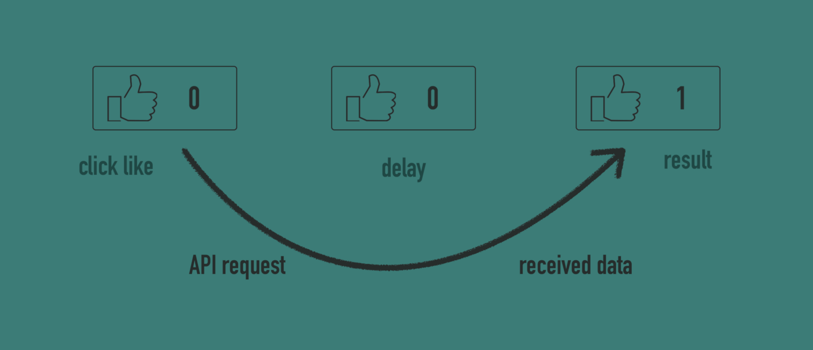
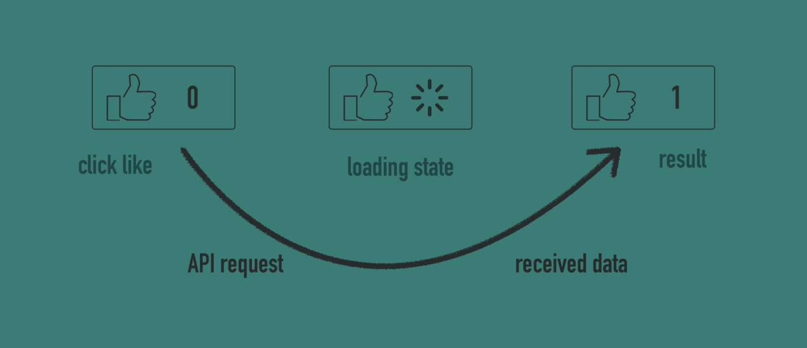
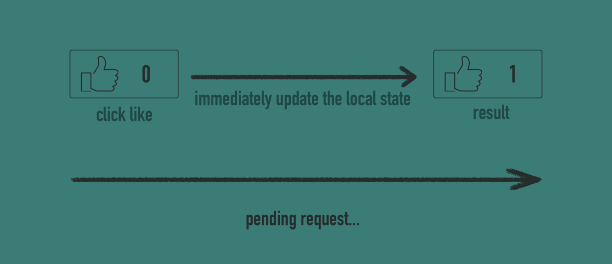
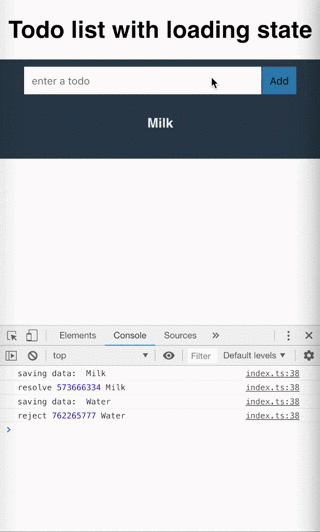
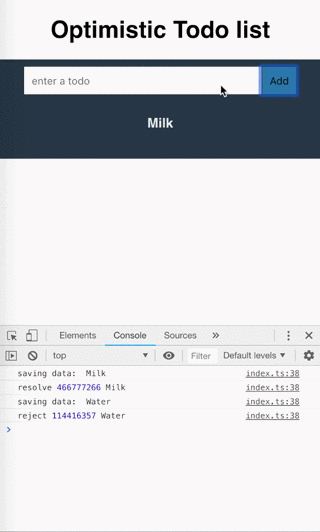

As front-end engineers, we want to provide the most reliable and comprehensive user interface by using many techniques, new technologies, frameworks or just our knowledge and experience. Everything just to achieve a better user experience and ensuring a clear and meaningful interface for the end user of our application.

Nowadays, one well-known technique that could improve our apps, is the _Optimistic UI_. This is a very simple solution to avoid some part of the loading states during the updates and pretending that some long time actions are called immediately. Sounds a bit weird, I know, but practically, it’s not a breakthrough — just straightforward technique.

Starting from scratch, just try to imagine, a very simple application that is doing something in the background asynchronously, let’s say… some request API call (for sure the most common). For instance, it could be a simple button which generates API call for every single click, such as Like button.

## 👍 The UX of the Like button

When we click the like button for sure it changes the state of our application, not only in the front-end app but also in backend side — that state must be saved. Without question, some API calls must be triggered and that means we have to wait for the response, it’s inevitable.




Above diagram presents that situation. We are clicking the button, but as an end user, we don’t know if it works. There is no reaction. Only what we can see is increasing the number of likes after some delay — the final result. That delay, of course, comes from API calls and when it finished, the likes pointer is growing.

A user is not aware of what is happening. Let’s try to solve that problem by introducing some reaction on click— displaying the loading state (I’m pretty sure you have been doing this).



Now when we click on the like button, the loading state appears until API call is finished. After API call, the number of likes goes up and end user can notice that something happened, it wasn’t a dead-click without reaction.

Now the new question arises — are we able to avoid that delay caused by API calls and increase the number of likes at the same time, immediately? The first answer that comes to our mind is definitely not, because we are changing the state of the application and that fact has to be saved, but… this is a point where Optimistic UI has something to say.

First of all, the actual thing what we do is just synchronization our front-end state with the state in the backend, so we can update our state as first and the API calls could be pending in the background. In the case when something went wrong with some call, we can reject our changes. That’s exactly how it works.



As you can see, now when we click “_Like_”, the changes are applying instantly. As a user, we see that action has just happened, but actually not, not yet. It’s waiting for backend save, but meanwhile, a user doesn’t see this — from his perspective, he has already “_liked_” something and can move forward.

## ⚡️Optimistic Todo list

Now we know what the _Optimistic UI_ actually is, so we are ready to use it in the real app. A classic example is, of course, the todo list. This app will be super easy. Only thing what we want to do is just add a new element to the list where mentioned element is the value of the input field. Furthermore, information about adding that element has to be sent to the backend, but this case we’ll simulate it by the code (look at the source in the examples). In order to compare two approaches — let’s try to build two version of this list.






The first one is the todo list with the loading state. We have to wait for adding a new item to the list (until the request is finished), so we have to add the information about what is happening (_saving…_ text in the button). The implementation is here:

```js
import React, { Component } from "react";
import TodoList from "./TodoList";
import TodoListItem from "./TodoListItem";
import saveRequest from "./saveRequest";

class TodoListContainer extends Component {
  constructor(props) {
    super(props);

    this.state = {
      loading: false,
      todos: []
    };
  }

  handleAddTodo = name => {
    this.setState({ loading: true });

    saveRequest(name)
      .then(receivedTodo => {
        this.setState(state => ({
          loading: false,
          todos: [...state.todos, receivedTodo]
        }));
      })
      .catch(() => {
        this.setState({ loading: false });
      });
  };

  render() {
    return (
      <TodoList onAddTodo={this.handleAddTodo} isLoading={this.state.loading}>
        {this.state.todos.map(todo => (
          <TodoListItem key={todo.id}>{todo.name}</TodoListItem>
        ))}
      </TodoList>
    );
  }
}

export default TodoListContainer;
```

[full demo link](https://codesandbox.io/s/48rovj9709)


Now, based on the existing code of loading state approach, we can change it to achieve the optimistic way. What is the algorithm of it?

Firstly, we have to assume the positive scenario and predict the results from the API. That predicted results we’ll show to the user, but they have to be unequivocal and recognizable in the code because we want to display them in a different way than rest (eg. darker or brighter color). How we can do this? For instance, by using some flag or the negative ID (when ID is positive, it means real one, otherwise — predicted)

As next, we have to send the request to the API. When it’s finished, replace the fake one (_predicted_) by the element comes from API. If some errors arise, we need to rollback our predicted stuff. Look at the code below:

```js
import React, { Component } from "react";
import TodoList from "./TodoList";
import TodoListItem from "./TodoListItem";
import saveRequest from "./saveRequest";

class TodoListContainer extends Component {
  constructor(props) {
    super(props);

    this.state = {
      todos: []
    };
  }

  handleAddTodo = name => {
    // Assume the success, set the fake id as a negative number
    this.setState(state => ({
      todos: [...state.todos, { id: -(state.todos.length + 1), name }]
    }));

    saveRequest(name)
      .then(receivedTodo => {
        this.setState(state => ({
          todos: state.todos.map(todo => {
            // Reopalce the fake element by the real one
            if (todo.name === receivedTodo.name) {
              return receivedTodo;
            }

            return todo;
          })
        }));
      })
      .catch(() => {
        // Rollback changes
        this.setState(state => ({
          todos: state.todos.filter(todo => todo.name !== name)
        }));
      });
  };

  render() {
    return (
      <TodoList onAddTodo={this.handleAddTodo}>
        {this.state.todos.map(todo => (
          <TodoListItem key={todo.id} optimistic={todo.id < 0}>
            {todo.name}
          </TodoListItem>
        ))}
      </TodoList>
    );
  }
}

export default TodoListContainer;
```

[full demo link](https://codesandbox.io/s/vy3zlqo3r5)


## 🚀 Using Apollo

The developers who are using GraphQL and Apollo stuff should be grateful of that convenient library. In terms of optimistic UI, we have to use just one config field to achieve the same outcome. Only what we need to do, is set the optimisticResponse field in _mutate()_ function. It determines how the response would look like (predicted response ) — exactly the same thing what we have done before.

```js
import React, { Component } from "react";
import { Query, Mutation } from "react-apollo";
import { TODOS_QUERY, ADD_TODO } from "./graphql";
import TodoList from "./TodoList";
import TodoListItem from "./TodoListItem";

class TodoListContainer extends Component {
  handleAddTodo = (todo, addTodo) => {
    addTodo({
      variables: {
        name: todo
      },
      // Optimistic response settings
      // Assuming the result
      optimisticResponse: {
        __typename: "Mutation",
        addTodo: {
          __typename: "Todo",
          // negative id as in the previous one
          id: -parseInt(
            Math.random()
              .toString(8)
              .substr(2, 9),
            10
          ),
          name: todo
        }
      }
    });
  };

  updateCache = (cache, { data: { addTodo } }) => {
    console.log(addTodo);
    const { todos } = cache.readQuery({ query: TODOS_QUERY });
    cache.writeQuery({
      query: TODOS_QUERY,
      data: { todos: [...todos, addTodo] }
    });
  };

  render() {
    return (
      <Query query={TODOS_QUERY}>
        {({ loading, error, data }) => {
          if (loading) {
            return "Loading...";
          }

          return (
            <Mutation mutation={ADD_TODO} update={this.updateCache}>
              {addTodo => (
                <TodoList onAddTodo={todo => this.handleAddTodo(todo, addTodo)}>
                  {data.todos.map(todo => (
                    <TodoListItem key={todo.id} optimistic={todo.id < 0}>
                      {todo.name}
                    </TodoListItem>
                  ))}
                </TodoList>
              )}
            </Mutation>
          );
        }}
      </Query>
    );
  }
}

export default TodoListContainer;
```

[full demo link](https://codesandbox.io/s/mj9wn7lq78)

That’s it! Everything is clear? It’s simple, isn’t it? 😃


Obviously, it doesn’t mean that you should use _Optimistic UI_ everywhere because there are some cases where we shouldn’t use it or even loading state is just better. Everything depends on kind of application, behavior, design and what UX we expect.
